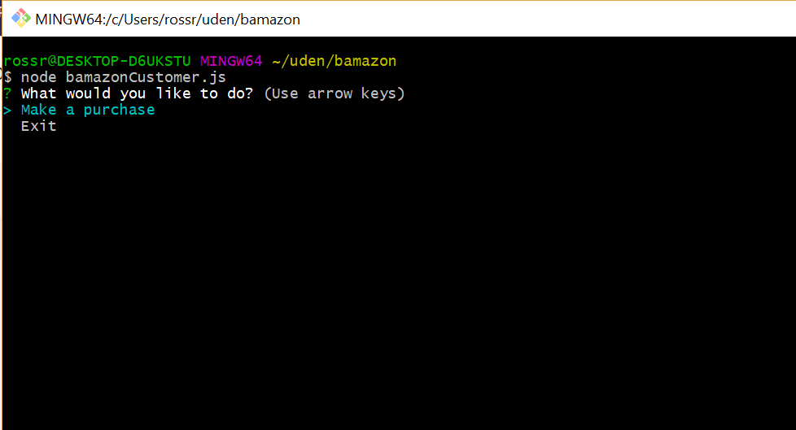
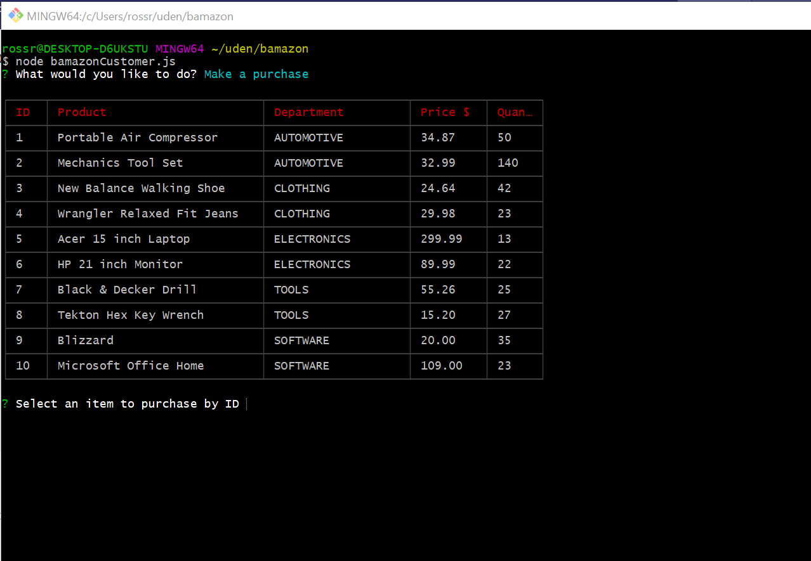
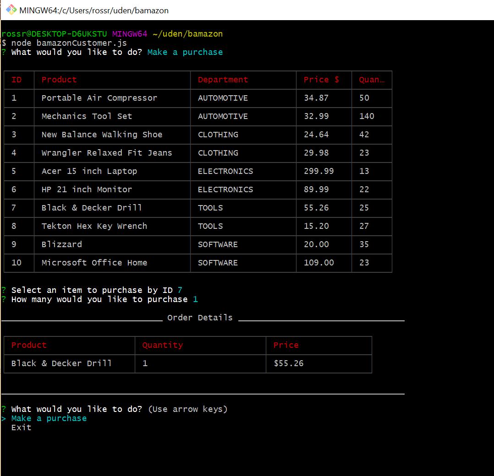
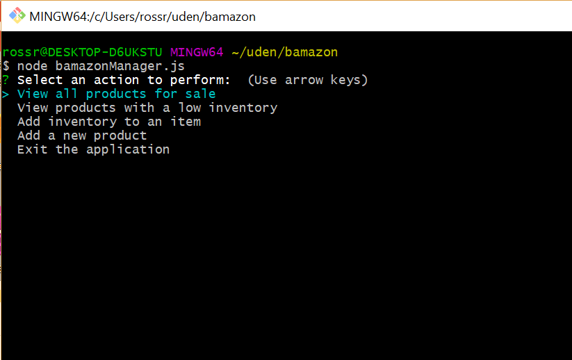
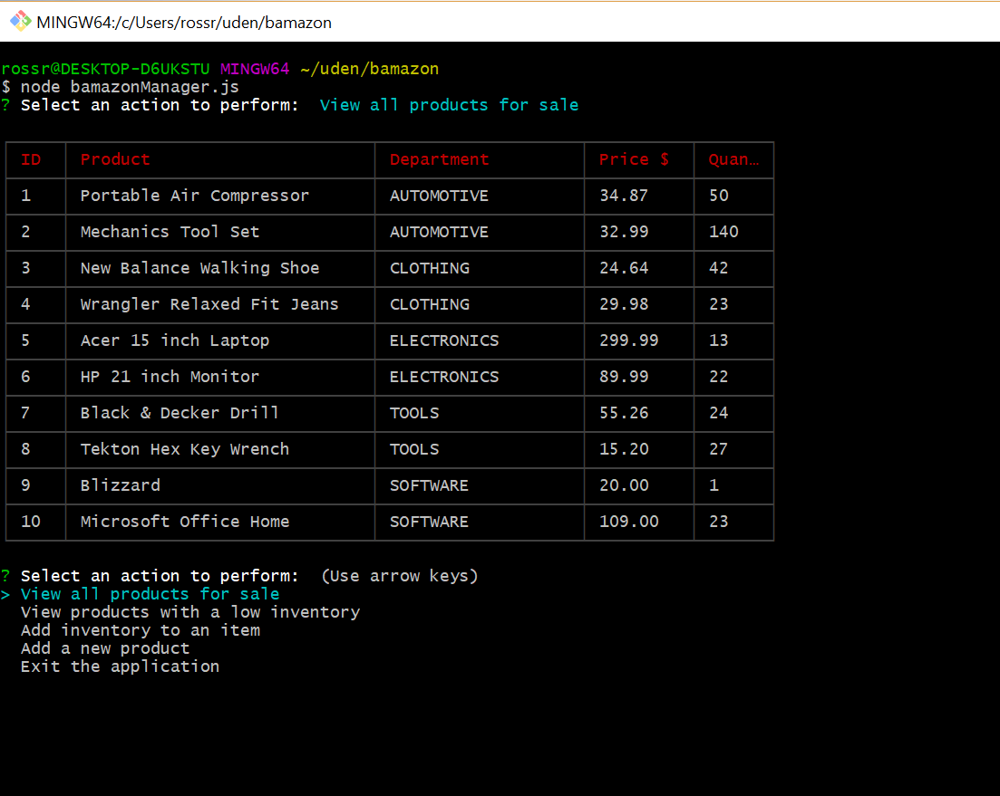
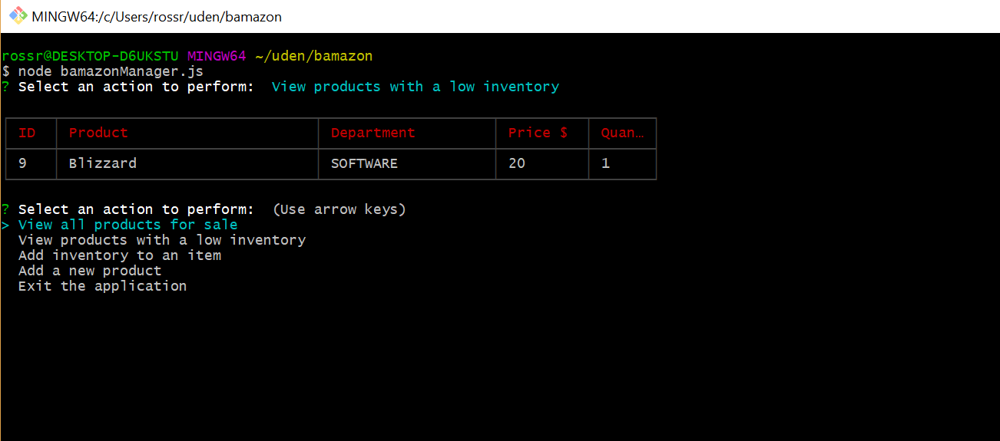
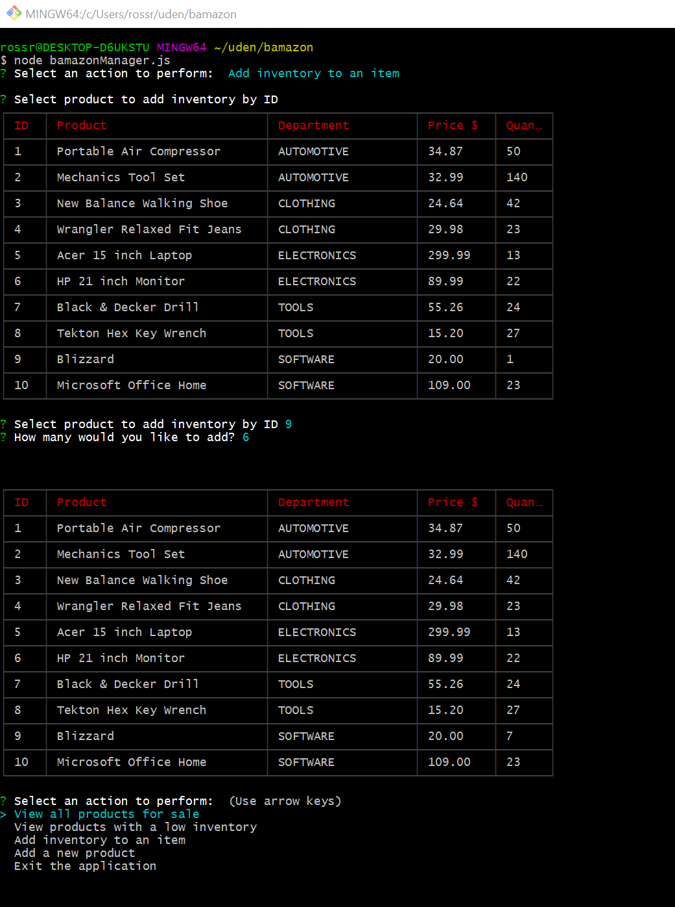
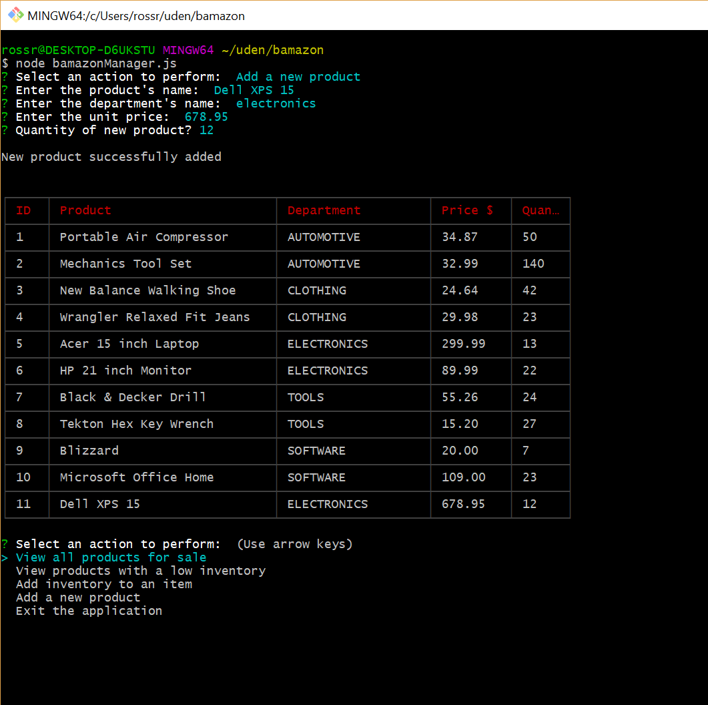

# Node.js & MySQL - bamazon

## Overview

This application uses MySQL, Node.js, and Inquirer to provide an Amazon-like 
storefront application. The application provides three application views, 
customer, manager, and supervisor.

### Dependencies

**npm install inquirer**
**npm install mysql**
**npm install cli-table**

### Customer View

This application view displays a database of products available for sale. The
product id, product name, department name, unit price, and quantity in stock 
is displayed for each product. The customer is then asked which item they would
like to buy and the quantity. Once the customer places the order, it is filled
and the database updated. If there is not a sufficient quantity to fill the
order, the customer is notified.

Customer view is started as follows: **node bamazonCustomer.js**

The above screen is displayed, and the customer is given a choice to:
    **Make a purchase**
    **Exit**

If the customer selects **Make a purchase**, a table of products for sale is
displayed.

The customer is then asked to select an item to purchase by ID, and how many
of the item they would like to purchase. If the purchase is successful, the
order details are displayed to the user, and the database is updated.

If there is not adequate units in stock to satisfy the order, the user is
notified, and given an opportunity to make another purchase. If an invalid
item id is entered, the user is notified, and given a chance to re-enter the
order.

### Manager View

This application view displays a menu for the user to select an action to
perform. 

Manager view is started as follows: **node bamazonManager.js**

The above menu is displayed, and the user is asked to select an action to
perform.

The **View all products for sale** option displays a table of the products
available for sale.

The **View products with a low inventory** option displays a table of the
products whose stock level is below the low inventory threshold. If there are
no products below the low inventory threshold, the user is notified.

The **Add inventory to an item** option allows the user to add inventory for
a product by item id. If the id is invalid, the user is notfied.

The **Add a new product** option allows the user to add a new product to the
database. Edits are performed on the information entered, and any errors are
displayed to the user.

