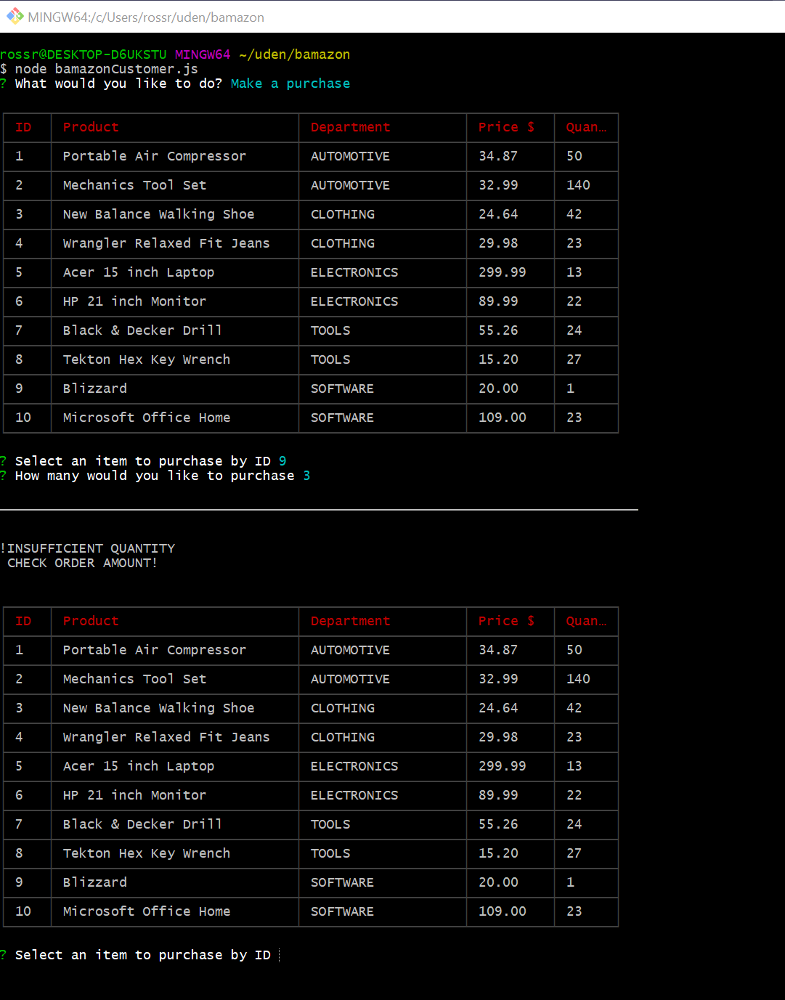

# Node.js & MySQL - bamazon

## Overview

This application uses MySQL, Node.js, and Inquirer to provide an Amazon-like 
storefront application. The application provides three application views, 
customer, manager, and supervisor.

### Customer View

This application view displays a database of products available for sale. The
product id, product name, department name, unit price, and quantity in stock 
is displayed for each product. The customer is then asked which item they would
like to buy and the quantity. Once the customer places the order, it is filled
and the database updated. If there is not a sufficient quantity to fill the
order, the customer is notified.

Customer view is started as follows: **node bamazonCustomer.js**

The above screen is displayed, and the customer is given a choice to:
    **Make a purchase**
    **Exit**

If the customer selects **Make a purchase**, a table of products for sale is
displayed.

The customer is then asked to select an item to purchase by ID, and how many
of the item they would like to purchase. If the purchase is successful, the
order details are displayed to the user, and the database is updated.

If there is not adequate units in stock to satisfy the order, the user is
notified, and given an opportunity to make another purchase. If an invalid
item id is entered, the user is notified, and given a chance to re-enter the
order.